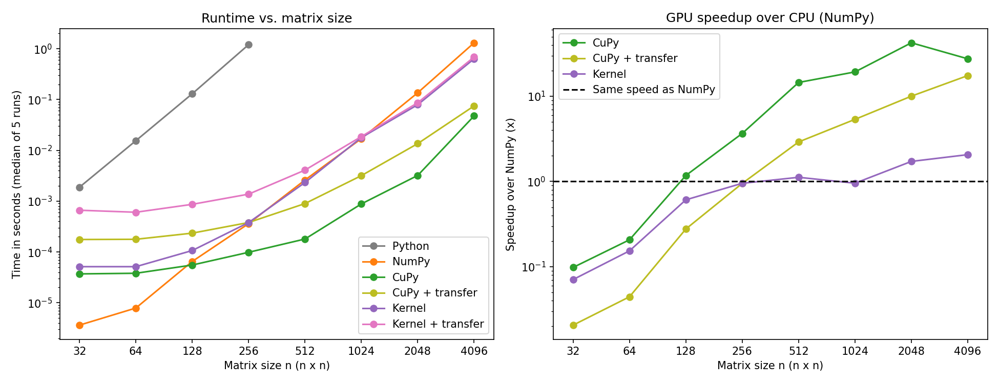

# GPU Matrix Multiplication Benchmark

[](https://colab.research.google.com/github/JoshuaKozo/gpu-matmul-benchmark/blob/main/gpu_matmul_benchmark.ipynb)

I built this project to learn how computation differs between CPUs and GPUs, and how those differences allow GPUs to accelerate AI. I compared matrix multiplication four ways on an NVIDIA Tesla T4: a pure Python triple loop, NumPy on the CPU, CuPy on the GPU, and a custom CUDA kernel I wrote with Numba.

## Important results

- CuPy (GPU) was **12,212×** faster than a pure Python triple loop at 256×256
- CuPy was up to **42×** faster than NumPy on the CPU (2048×2048), and **17.5×** faster at 4096×4096 even including CPU↔GPU data transfer
- The GPU only beat the CPU starting at **128×128** (compute only) or **512×512** (including data transfer)
- My custom CUDA kernel was **2.1×** faster than NumPy at 4096×4096, and making its memory access coalesced **doubled** its speed with no change to the math



## Why matrix multiplication?

Matrix multiplication is an extremely useful benchmark, as it is the basis of training and running the neural networks used in AI, and its O(n³) work makes it a demanding test of how fast hardware can compute. GPUs are uniquely suited for large-scale matrix multiplication as a result of each entry in the output matrix C being an independent dot product. This allows each entry in C to be computed by its own thread. A 4096×4096 multiply in this project launched about 16.7 million threads, spread across the T4's 2,560 cores.

## What I built

- **Pure Python triple loop:** Uses three nested for loops: the `i` and `j` loops pick each entry of the output matrix C, and the `k` loop computes that entry's dot product, resulting in O(n³) work (about 1.2 seconds at just 256×256).
- **NumPy (CPU):** Does the same O(n³) math, but much faster because NumPy uses BLAS (Basic Linear Algebra Subprograms), an optimized library that runs compiled code, works in cache-sized blocks, uses SIMD (single instruction, multiple data) instructions, and runs across multiple CPU cores, making it about 3,300× faster than the Python loop at 256×256.
- **CuPy (GPU):** A NumPy-compatible library that copies the matrices into GPU memory and runs the multiplication with NVIDIA's cuBLAS library, up to 42× faster than NumPy.
- **Custom CUDA kernel (Numba):** I wrote a kernel, compiled with Numba's `@cuda.jit`, that turns the `i` and `j` loops into a grid of GPU threads, where each thread corresponds to one entry of the output matrix C and runs only the `k` loop. Each thread does O(n) work, but with n² threads the total is still O(n³). The speedup comes from running thousands of threads in parallel. It was 2.1× faster than NumPy at 4096×4096.

The Python loop, CuPy and my kernel were all checked against NumPy with `np.allclose` before timing. Matrices are random `float32`, 8 sizes from 32×32 to 4096×4096.

## Important Notes for Measurements

- **Warm up first:** Every method ran an untimed "warm up" before measuring to ensure that the one time costs of getting the GPU ready (starting it up, loading cuBLAS, and compiling my CUDA kernel) would not skew the data unfairly.
- **`synchronize()` before stopping the timer:** GPU calls are asynchronous, so without synchronize Python would just move on as soon as the job is sent rather than waiting for the GPU to complete its computation. This would have resulted in simply measuring the time it took to launch and not the computation time.
- **Median of 5 runs:** I used a median in this case as opposed to an average to exclude noisy data that arises from using Colab. As a result of Colab being a shared cloud platform, other users and their requests may introduce variation in run times as there is a brief competition for the machine's resources.
- **With and without data transfer:** For a more accurate comparison for real world applications, I also tested each of the GPU methods with and without CPU↔GPU transfer time to assess the amount of time each computation would take in practice.

## Results

Median time in milliseconds:

| n | Python | NumPy | CuPy | CuPy + transfer | Kernel | Kernel + transfer |
|---|---|---|---|---|---|---|
| 32 | 1.883 | 0.004 | 0.037 | 0.176 | 0.051 | 0.663 |
| 64 | 15.489 | 0.008 | 0.038 | 0.178 | 0.051 | 0.605 |
| 128 | 129.870 | 0.065 | 0.055 | 0.235 | 0.107 | 0.866 |
| 256 | 1203.627 | 0.361 | 0.099 | 0.380 | 0.379 | 1.374 |
| 512 | — | 2.610 | 0.180 | 0.897 | 2.331 | 4.088 |
| 1024 | — | 17.033 | 0.883 | 3.181 | 17.843 | 18.686 |
| 2048 | — | 136.063 | 3.212 | 13.581 | 79.136 | 86.545 |
| 4096 | — | 1308.471 | 47.608 | 74.941 | 633.900 | 687.471 |

## What I learned

**The GPU isn't always faster**

As a result of needing to set up the GPU for computation and limited improvements from a greater number of cores at small sizes, in my data, for n less than 128 the CPU was actually faster. When also including data transfer times necessary in practical applications of using GPU computation, that break-even point rose from 128 to 512. This outcome highlights how at small scales the necessary step of data transfer to a GPU outweighs the benefits associated with GPU computation.

**Optimizing memory is super cool**

This was by far and away the most interesting aspect to me, as when first performing this experiment, I had assumed that switching the rows and columns in my CUDA grid would not result in any meaningful change in performance. However, when swapping the rows and columns, my CUDA kernel was 2× faster, going from 1.27 s → 0.63 s at n = 4096. While the computations themselves stayed the same, the effect of swapping the rows and columns comes in the form of memory optimization. This optimization is called memory coalescing. In this specific case, matrices are stored in memory in a row by row format, and GPU threads run in warps of 32 that read memory at the same time. What this results in is when a warp is trying to perform a computation, it needs to read each of the necessary inputs, which in my original kernel were in up to 32 separate chunks, as the values needed for computation were all n positions away from each other. When swapping the order to col, row, the matrix is still stored row by row, but consecutive threads now handle consecutive columns instead of consecutive rows, allowing a single 128-byte fetch to retrieve the 32 neighboring values the warp's threads need. Because the kernel is memory-bound, this memory coalescing greatly improves performance without altering the underlying math.

## Limitations of Project and What I'm Curious About Next

**Limitations**

- This test specifically ran on a Tesla T4, so with differing hardware, different results are expected which could impact efficiency improvements and computation time across each of the methods that I tested.
- During larger computations the T4 may have throttled, explaining why the efficiency improvements in my CuPy method began to drop, especially from 2048 to 4096.
- On the smallest values of n, especially n = 32, 64 and 128, the timings are quite noisy. This arises as a result of the computation taking only microseconds, so the disturbances that arise from things like the background activity on the shared machine and the timer's own overhead can end up being as large as the computation we are actually measuring.

**Curiosities**

While I love seeing the practical implementation of mathematics, one thing that really interested me was the memory optimization aspect of this project. By simply changing which thread handled which entry, there was massive room for improvement in computation on what seemed like identical mathematical operations. I'm super interested in diving deeper into how certain types of memory operate and how the arrangement of data in memory can drastically alter the computation speed and therefore performance of some of the most interesting technology in the world. While I've heard of CUDA C++, I don't know much about it, so I'm excited to begin understanding how it can provide even greater efficiencies than what I was able to achieve through Numba.

## How to run

Click the **Open in Colab** badge above, select **Runtime → Change runtime type → T4 GPU**, then **Runtime → Run all**.

To run locally (requires an NVIDIA GPU):

```bash
pip install -r requirements.txt
jupyter notebook gpu_matmul_benchmark.ipynb
```
